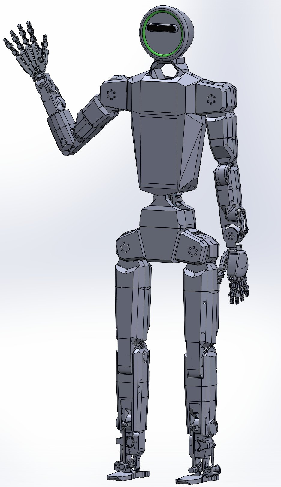
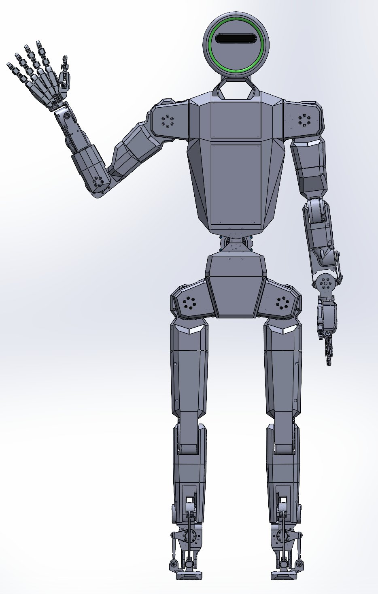
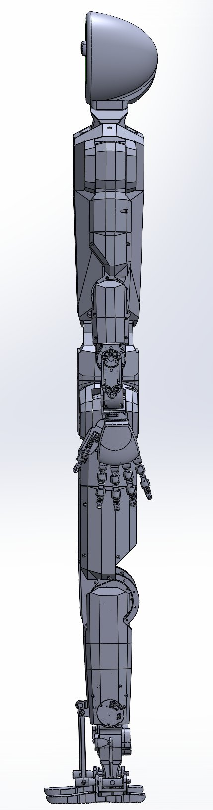

# 🤖 open-kumanday-humanoid

**Fully open humanoid platform. Target cost under $5K. In development.**

---

> *Kumanday* — name given in Quimbaya to a volcano in the central region of Colombia.

---

## Overview

Open-Kumanday is a fully open-source humanoid platform designed for accessible embodied AI research. The structure is built from laser-cut and press-brake-formed sheet metal enclosures, CNC-machined structural nodes and joint brackets, and FDM-printed secondary components. Target build cost under $5,000 USD.

Actuated by Robstride quasi-direct-drive BLDC motors throughout. End effectors are [open-yta-hand](https://github.com/yourusername/open-yta-hand) Mk1 — a monolithic anthropomorphic underactuated dexterous hand.

Inspired by [K-Scale K-Bot](https://kscale.dev/), [Boston Dynamics Atlas](https://www.bostondynamics.com/atlas), and [Fourier Robotics N1](https://fourierintelligence.com/).

  
   <em>Open-Kumanday — isometric view.</em>

  
  &nbsp;&nbsp;
  
   <em>Front and side views.</em>

---

## Target Specifications

### Mechanical

| Parameter | Value |
|---|---|
| Height | 165 cm |
| Mass | ~40 kg |
| Total DOF | 28 + 2 dexterous hands |
| Target cost | < $5,000 USD |
| Structure | Laser-cut + press-brake sheet metal, CNC structural nodes, FDM parts |

### Degrees of Freedom

| Limb | DOF | Notes |
|---|---|---|
| Left leg | 6 | Hip roll/pitch/yaw, knee pitch, ankle pitch/roll |
| Right leg | 6 | Hip roll/pitch/yaw, knee pitch, ankle pitch/roll |
| Pelvis | 2 | Hip yaw + lateral flexion |
| Left arm | 7 | Shoulder 3-DOF, elbow 1-DOF, wrist 3-DOF |
| Right arm | 7 | Shoulder 3-DOF, elbow 1-DOF, wrist 3-DOF |
| **Total** | **28** | |
| End effectors | — | open-yta-hand Mk1 (third-party, not counted) |

### Performance

| Parameter | Value |
|---|---|
| Total payload | 8 kg |
| Per-arm payload | 2 kg |
| Operational runtime | 2–3 hours |

### Actuation

All joints driven by [Robstride](https://robstride.com/) quasi-direct-drive BLDC motors.
Motor documentation and control API: [Robstride wiki](https://wiki.seeedstudio.com/robstride_control/).

### Sensing

| Subsystem | Hardware |
|---|---|
| Proprioception | 3-axis IMU |
| 3D perception | 3D LiDAR (neck-mounted) |
| Visual perception | RGB-D camera (eye) + stereo vision pair |
| Audio input | Far-field microphone array |
| Audio output | Stereo speakers |

---

## Roadmap

| Component | Status |
|---|---|
| Mechanical design | ✅ Done |
| Motor selection | ✅ Done |
| BOM | 🚧 In progress |
| STEP files for manufacturing | 🚧 In progress |
| Assembly documentation | 🚧 In progress |
| Whole-body dynamics model (MuJoCo) | ⏳ Planned |
| URDF / USD for simulation (Isaac Sim / Isaac Lab) | ⏳ Planned |
| Low-level joint torque control | ⏳ Planned |
| Whole-body controller (WBC) | ⏳ Planned |
| Locomotion policy — sim-to-real | ⏳ Planned |
| ROS2 integration | ⏳ Planned |
| VLA integration (open-poporo) | ⏳ Planned |

---

## Related Repositories

| Repository | Description |
|---|---|
| [open-yta-hand](https://github.com/yourusername/open-yta-hand) | Monolithic anthropomorphic hand — end effector for this platform |
| [open-poporo-vla](https://github.com/yourusername/open-poporo-vla) | Open VLA model for edge deployment — target controller for this platform |
| [open-huca-skin](https://github.com/yourusername/open-huca-skin) | Open tactile skin — force and shape sensing for integration |

---

## Acknowledgements

Inspired by:
- [K-Scale K-Bot](https://kscale.dev/)
- [Boston Dynamics Atlas](https://www.bostondynamics.com/atlas)
- [Fourier Robotics N1](https://fourierintelligence.com/)

Actuation:
- [Robstride](https://robstride.com/)

---

## Author

**Gilberto Galvis Giraldo**
M.Sc. Electrical and Computer Engineering — Sungkyunkwan University

---

## License

Apache License 2.0 — see [LICENSE](LICENSE) for details.
